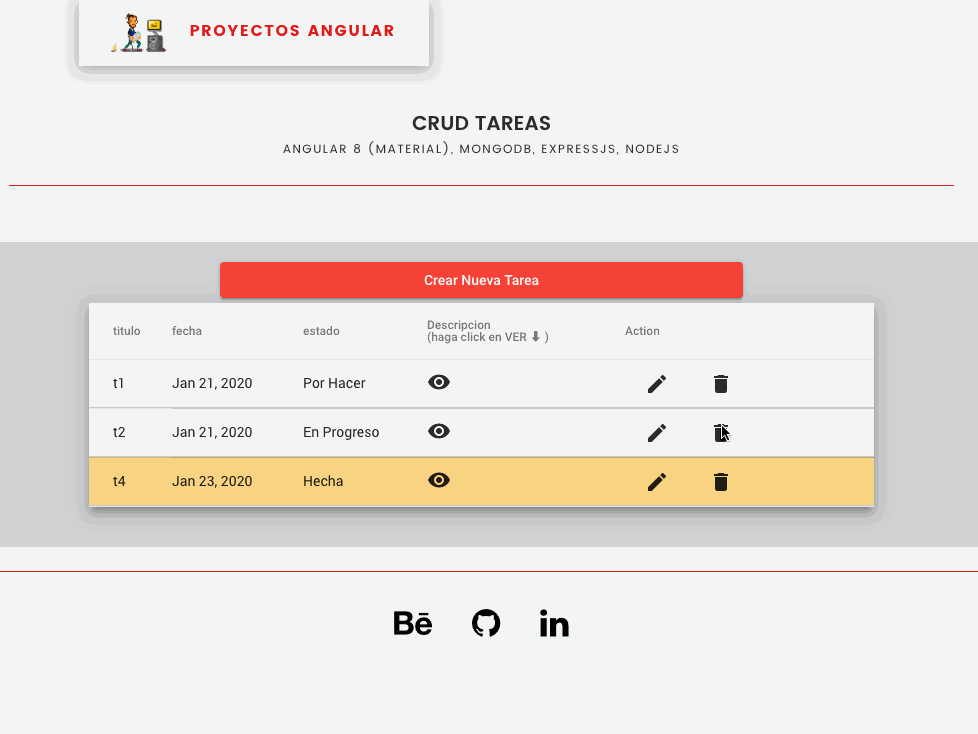

# TareasApp

A simple CRUD application of Little TASK.

The application is built using Angular 8 with Angular Material and TypeScript on the frontend, NodeJS and ExpressJS and MongoDB on the backend.

Environment Setup
You need to have Docker to be able to build and run the application.

How to build and run
Build the backend application image

docker build -t=cs-backend -f Dockerfile.backend .

Build the frontend application image

docker build -t=cs-frontend -f Dockerfile.frontend .

Create a docker network

docker network create cs-net

Start the database

docker run -p 5432:5432 \
  -e POSTGRES_USER=company-structure \
  -e POSTGRES_PASSWORD=company-structure \
  -e POSTGRES_DB=company-structure \
  --name cs-db \
  --net=cs-net \
  postgres:11.5
Start the backend

docker run --name=cs_backend \
     --net=cs-net \
     -p 8080:8080 \
     cs-backend:latest
Start the frontend

docker run --name=cs_frontend \
     -p 4200:4200 \
     cs-frontend:latest
The application is accessible on http://localhost:4200.
